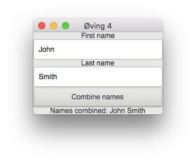

### Øving 4: Konteinere, auto og lambda
## Oppgave 1
Lag et lite program:

Opprett en vektor av double. Legg inn fem tall (behøver ikke leses inn.)

Prøv ut medlemsfunksjonene ```front()``` og ```back()```. De returnerer hver et element, og de har ingen argumenter.

Bruk ```emplace()``` til å sette inn et tall etter det første elementet. Skriv ut resultatet av ```front()``` etterpå.

Prøv ut STL-algoritmen ```find()```. Den tar tre argumenter: start, slutt og søkeverdi. De to første er iteratorer til søkeintervallet. Funksjonen returnerer en iterator til den funne verdien, hvis den finnes. Hvis den ikke finnes, er returverdien lik ```end()```-iteratoren. Lag et ```if```-uttrykk som sjekker om resultatet av ```find()``` er vellykket eller ikke, og dersom resultatet var vellykket, skriv ut den funne verdien.

## Oppgave 2
Ta utgangspunkt i https://gitlab.com/ntnu-iini4003/gtkmm-example og lag eit lite program som slår sammen inntastet fornavn og etternavn når du klikker på en knapp. Knappen skal kun være sensitiv når både fornavn og etternavn er tastet inn, og grået ut ellers (ikke sensitiv). Sett også tittel på vinduet. To eksempler på hvordan programmet kan se ut er vist under:
